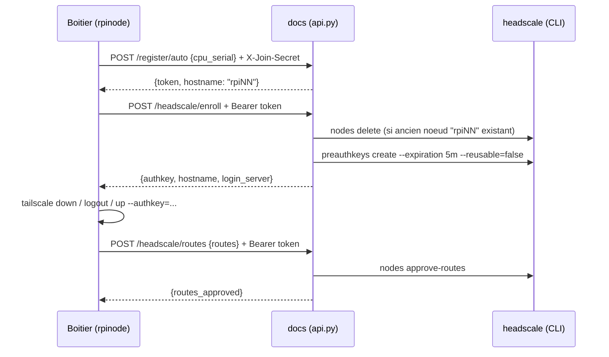

# Enrôlement automatique Headscale (identité + réseau), 8 septembre 2026

## 1. Objectif

Avant cette évolution, ajouter un Raspberry Pi au réseau Headscale (voir
[`../operations/HEADSCALE_MIGRATION_STATUS.md`](../operations/HEADSCALE_MIGRATION_STATUS.md))
nécessitait une intervention manuelle en SSH sur `docs` : génération d'une
clé de pré-authentification, puis `tailscale up` manuel sur le boîtier, puis
approbation manuelle des routes.

Cette évolution automatise entièrement le processus pour tout **nouveau**
boîtier de la flotte, en réutilisant le mécanisme d'adhésion déjà en place
(`FLEET_JOIN_SECRET` / `fleet_token`, voir `src/services/fleet.py`) plutôt
que de créer un secret supplémentaire.

Un boîtier fraîchement imagé n'a besoin d'aucune action manuelle : au
démarrage, il s'enregistre lui-même auprès de `docs`, se voit attribuer un
nom (`rpiNN`), puis rejoint automatiquement le réseau Headscale.

## 2. Vue d'ensemble du flux



Le tout est **idempotent** : si le boîtier est déjà correctement rattaché à
Headscale (`ControlURL` = `https://docs.deltathermic.be` et backend
`Running`), l'enrôlement initial (`/register/auto` + `/headscale/enroll`)
n'est pas rejoué.

**Point important : les routes annoncées ne sont pas figées à
l'enrôlement.** `POST /headscale/routes` est rappelé à **chaque**
recalcul des routes locales côté client
(`services/network_config.py::publish_tailscale_routes()`), pas seulement
une fois à l'installation. Cette fonction est déjà appelée automatiquement
au démarrage **et** à chaque changement de profil réseau `eth0` (donc à
chaque changement de chantier, via `apply_site_network_profiles`). C'est
nécessaire car, contrairement au SaaS Tailscale, **Headscale n'approuve pas
automatiquement une route annoncée** : sans ce rappel systématique, un
boîtier changeant de chantier (donc de sous-réseau LAN) resterait à jamais
accessible uniquement sur l'ancienne route approuvée.

## 3. Identifiant matériel : numéro de série CPU

L'identifiant utilisé pour reconnaître un boîtier de façon stable est le
**numéro de série du CPU du Raspberry Pi** (`/proc/cpuinfo`, ligne
`Serial`), plutôt qu'une adresse MAC : il est unique par carte, gravé dans
le SoC, et indépendant de l'interface réseau active (utile si un boîtier
tourne un jour uniquement sur 4G, sans `eth0`).

Voir `get_cpu_serial()` dans `src/services/headscale_enroll.py`.

## 4. Modifications côté client (`rpinode`, versionné)

### `src/services/fleet.py`

Trois nouvelles méthodes sur `FleetClient` :

- `register_auto(cpu_serial)` → `POST /register/auto`, retourne le hostname
  attribué et mémorise le nouveau `fleet_token`.
- `headscale_enroll()` → `POST /headscale/enroll`, retourne
  `{authkey, hostname, login_server}`.
- `headscale_sync_routes(routes)` → `POST /headscale/routes`, fait
  approuver côté serveur exactement l'ensemble de routes fourni (remplace
  toute approbation précédente). Appelée à la fin de l'enrôlement **et**
  à chaque appel de `network_config.py::publish_tailscale_routes()`.

### `src/services/headscale_enroll.py` (nouveau)

Orchestration complète :

- `get_cpu_serial()` : lit `/proc/cpuinfo`.
- `is_headscale_active()` : vérifie l'état réel via `sudo tailscale debug
  prefs` (`ControlURL`) et `sudo tailscale status --json`
  (`BackendState`) — **pas de fichier marqueur local** : l'état de
  référence est toujours l'état réel de `tailscaled`, pour rester
  auto-réparant après un `tailscale logout` manuel par exemple.
- `ensure_fleet_identity()` : garantit un `fleet_token` + un hostname
  assigné (`config.json` → `fleet_assigned_hostname`). Pour un boîtier déjà
  enregistré via l'ancien flux manuel (ex: `rpi01`), reprend simplement le
  nom de machine existant sans le modifier.
- `ensure_headscale_enrolled()` : point d'entrée principal, appelé au
  démarrage. Ne gère que l'enrôlement initial (jusqu'à obtenir un
  `tailscale up` réussi) ; la synchronisation des routes au fil de l'eau
  est gérée séparément (voir ci-dessous).

### `src/main.py`

Un thread démon dédié (même pattern que `tracker_thread`/`wifi_thread`)
appelle `ensure_headscale_enrolled()` avec jusqu'à 10 tentatives espacées de
30s (le temps que le réseau/modem 4G soit opérationnel), puis abandonne
jusqu'au prochain démarrage.

### `src/services/network_config.py`

`publish_tailscale_routes()` (préexistante, appelée au démarrage et à
chaque changement de profil réseau `eth0`, donc à chaque changement de
chantier) appelle désormais aussi, après le `tailscale set
--advertise-routes=...` habituel, `fleet.headscale_sync_routes(routes)` —
mais uniquement si `headscale_enroll.is_headscale_active()` est vrai
(sans effet pour un boîtier encore sur le SaaS Tailscale, ou pas encore
enrôlé). C'est ce qui garantit que les routes restent approuvées même
après un changement de sous-réseau LAN en cours de vie du boîtier, pas
seulement lors de l'installation initiale.

### `src/core/config.py`

Nouvelle clé `fleet_assigned_hostname` dans `DEFAULT_CONFIG`.

## 5. Modifications côté serveur (`docs`, hors dépôt Git)

Comme pour les autres évolutions de l'API centrale, ce qui suit vit
uniquement dans `/var/www/reports/api.py` sur `docs` (voir
[`FLEET_API_CHANGES.md`](FLEET_API_CHANGES.md) pour le contexte général de
cette API hors dépôt). `API_VERSION` est passée à `1.2.0`.

### Schéma (`boitier_registre`)

Deux colonnes ajoutées par migration `ALTER TABLE ... ADD COLUMN IF NOT
EXISTS` (MariaDB 10.6) :

- `cpu_serial VARCHAR(32) UNIQUE NULL` : numéro de série CPU, `NULL` pour
  les boîtiers enregistrés via l'ancien flux manuel (backfillé pour `rpi01`
  après coup : `100000004d559626`).

(Une colonne `headscale_pending_routes` avait été ajoutée dans une première
version de ce mécanisme, le temps de stocker les routes entre l'enrôlement
et la confirmation. Elle a été supprimée (`DROP COLUMN`) après le passage à
une synchronisation directe et répétable via `POST /headscale/routes`,
devenue inutile.)

### `POST /register/auto`

- Auth : `X-Join-Secret` (même secret que `/register`).
- Payload : `{"cpu_serial": "..."}`.
- Si `cpu_serial` déjà connu (réinstallation d'une carte SD) : régénère le
  jeton (`token_hash`), conserve le même hostname.
- Sinon : attribue le prochain nom `rpiNN` libre (`_next_rpi_hostname`,
  calculé par scan de `boitier_registre.hostname` avec le motif
  `^rpi[0-9]+$`, incrément simple — pas de verrouillage dédié, risque de
  collision négligeable vu le volume de la flotte et le retry sur
  `IntegrityError` en cas de collision).
- Réponse : `{ok, token, hostname}`.

### `POST /headscale/enroll`

- Auth : `Authorization: Bearer <fleet_token>` (réutilise
  `authenticate_boitier()`, déjà utilisé par `/sync`, `/trends`, etc.).
- Pas de payload necessaire.
- Supprime un éventuel ancien nœud Headscale portant le même nom
  (`headscale nodes delete --force`), puis crée une clé de pré-auth
  **à usage unique, expirant en 5 minutes**
  (`headscale preauthkeys create --user 1 --expiration 5m --reusable=false`).
- Réponse : `{ok, authkey, hostname, login_server}`.

### `POST /headscale/routes`

- Auth : identique à `/headscale/enroll`.
- Payload : `{"routes": ["10.42.0.0/24", ...]}` (liste vide/absente = retire
  toutes les routes approuvées).
- Recherche le nœud Headscale par nom (`hostname` du boîtier), et fait
  correspondre exactement l'ensemble des routes approuvées à celui fourni
  (`headscale nodes approve-routes --routes ...`, qui remplace l'ensemble
  précédent plutôt que de l'étendre).
- Sans effet (`ok: true, routes_approved: []`) si le nœud n'existe pas
  encore (le `tailscale up` n'a pas encore abouti).
- Appelée à la fin de l'enrôlement initial **et** à chaque appel de
  `publish_tailscale_routes()` côté client (donc à chaque changement de
  chantier).
- Réponse : `{ok, routes_approved}`.

### Commandes `headscale` utilisées côté serveur

Toutes exécutées en `subprocess` par l'utilisateur système qui fait tourner
l'app `reports` (`mariadb`, déjà membre du groupe unix `headscale` depuis la
mise en place de l'interface `/headscale-admin/`, voir
`~/HEADSCALE_SUMMARY.md` section 7 sur `docs`) :

```bash
headscale nodes list -o json
headscale nodes delete --identifier <id> --force
headscale preauthkeys create --user 1 --expiration 5m --reusable=false -o json
headscale nodes approve-routes --identifier <id> --routes <routes>
```

### Point d'attention : longueur de la colonne `action`

`boitier_sync_log.action` est un `VARCHAR(16)`. Les libellés d'audit
utilisés pour ces nouvelles routes sont donc volontairement courts :
`register-auto`, `re-register`, `hs-enroll`, `hs-routes` (le libellé complet
`headscale-confirm`, utilisé dans une première version, dépassait la limite
et provoquait une erreur `1406 Data too long`, corrigé pendant la mise en
place).

## 6. Validation effectuée (8 septembre 2026)

- Migration de schéma appliquée et vérifiée (`SHOW CREATE TABLE
  boitier_registre`).
- `rpi01` backfillé avec son `cpu_serial` réel (pour que le flux automatique
  fonctionne aussi en cas de réinstallation future de sa carte SD).
- Patch de `api.py` appliqué avec sauvegarde préalable
  (`api.py.bak_20260908_174200_pre_headscale_enroll`), validé par
  `python3 -m py_compile` avant redémarrage du service `reports` (uwsgi).
- Cycle complet testé en conditions réelles avec un `cpu_serial` fictif
  (`TEST-SERIAL-0001`, supprimé après coup) :
  - `POST /register/auto` → attribution correcte de `rpi02`.
  - `POST /headscale/enroll` → clé de pré-authentification générée.
  - `POST /headscale/routes` → `200 OK`, `routes_approved: []` (aucun
    nœud réel créé pendant ce test, comportement attendu).
- Après généralisation de `/headscale/routes` (pour gérer les changements
  de chantier, pas seulement l'enrôlement initial) : testé avec le vrai
  jeton de `rpi01` en lui faisant ré-approuver ses routes déjà approuvées
  (`10.42.0.0/24`, `192.168.1.0/24`) — `200 OK`, routes toujours
  `Approved`/`Serving` après coup (`headscale nodes list-routes`). Puis
  redémarrage complet du service `rpinode` (`./run.sh`, 76/76 tests) :
  logs confirment la publication des routes au démarrage sans aucune
  erreur côté Headscale.
- Côté client, `ensure_fleet_identity()` et `is_headscale_active()` testés
  directement sur `rpi01` : détecte correctement que l'appareil est déjà
  actif sur Headscale et ne déclenche aucune action.
- `./run_tests.sh` exécuté après les modifications : aucune régression
  imputable à ces changements (un échec pré-existant sans rapport,
  `test_presence.py::test_auto_site_is_provisional`, était déjà présent
  avant cette évolution — lié à un fichier `/tmp/rpinode_current_site.json`
  appartenant à `root`, laissé par le service réel en cours d'exécution).

## 7. Limites connues / pistes d'amélioration

- Pas de verrou explicite lors de l'attribution du prochain `rpiNN` :
  acceptable vu la taille actuelle de la flotte, à revoir si
  l'enregistrement simultané de nombreux boîtiers devient fréquent.
- Le nom d'hôte **applicatif** (`fleet_assigned_hostname`, utilisé pour
  Headscale et l'identité de flotte) n'est volontairement **pas** répercuté
  sur le hostname OS réel (`hostnamectl`) : cela évite les effets de bord
  (clés SSH, confusion dans les logs système) mais signifie que
  `hostname` (commande Linux) et le nom Headscale/flotte peuvent différer
  sur un boîtier auto-enregistré. À harmoniser plus tard si souhaité.
- Pas d'interface web pour suivre l'état d'enrôlement Headscale depuis
  l'admin `rpinode` (actuellement uniquement visible dans les logs et via
  `tailscale status`).
