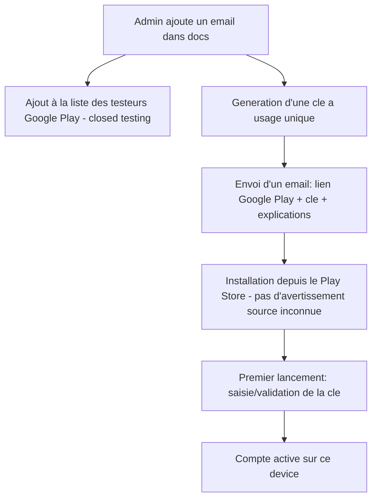

# Cahier des charges — Application mobile native rpinode (Android, V1)

Ce document est destiné à être transmis à une IA (ou une équipe de dev) pour
concevoir et implémenter l'application mobile. Il synthétise les décisions
prises avec Marc (propriétaire du projet `rpinode`), issues d'une session de
cadrage progressive. Les points encore ouverts sont listés explicitement en
fin de document — ne pas les deviner, les trancher avec Marc avant de coder
la partie correspondante.

## 1. Contexte

`rpinode` est le logiciel embarqué d'un boîtier Raspberry Pi industriel
(passerelle BACnet MS/TP, Modbus RTU/TCP, GSM/4G, gestion réseau) déployé sur
des chantiers. Chaque boîtier expose une interface web d'administration
locale (serveur HTTP Python, port `8082` par défaut, templates "poupée
russe", SSE pour le temps réel) et se synchronise périodiquement (toutes les
60 secondes, voir `src/services/tracker.py` → `fleet.sync_location()`) avec
un serveur central de flotte, `docs.deltathermic.be`, qui héberge aussi une
interface web humaine "reports" (`/reports`, protégée par SSO — voir
section 4).

## 2. Principe général de l'application

L'application mobile est **une coquille native qui encapsule** :

1. Les interfaces web de chaque `rpinode` de la flotte (une WebView par
   boîtier, consultée à la demande).
2. La partie "reports" du serveur central `docs.deltathermic.be`.

Ce n'est **pas** une réécriture native de ces interfaces : le contenu web
existant continue de vivre côté serveur (`rpinode` et `docs`). L'app ajoute
une couche de **sélection, d'authentification, de statut de flotte et de
suivi de points en tableau de bord** (widgets), qui elle est native.

## 2 bis. Architecture de navigation

L'app s'organise autour de **4 onglets principaux** (navigation basse,
toujours visible) :

- **Flotte** : le sélecteur de nœuds (section 6) — écran d'entrée par
  défaut de l'app.
- **Dashboard** : les widgets de suivi de points et leurs alarmes
  (sections 8 et 9).
- **Rapports** : la partie "reports" du serveur central `docs`
  (encapsulée en WebView, cf. section 2).
- **Paramètres** : gestion du compte (statut d'activation, déconnexion),
  informations sur l'app, et état de la connexion Tailscale/Headscale
  (voir section 6.1). Contenu exact à affiner à l'implémentation.

## 3. Périmètre plateforme (V1)

- **Android natif uniquement.**
- **iOS explicitement hors périmètre** de cette V1 (pas d'appareil de test
  disponible actuellement). Un cahier des charges dédié sera rédigé plus
  tard si le besoin se confirme — ne pas anticiper de compromis iOS dans
  cette version (ex: pas besoin de dégrader l'expérience pour rester
  compatible iOS).

## 4. Authentification et gestion des utilisateurs

### 4.1 Fournisseur d'identité

Le fournisseur SSO n'est pas structurant : `docs.deltathermic.be` protège
déjà `/reports` via OAuth/OIDC (Azure AD/Entra ID normalement, actuellement
basculé sur Google le temps qu'Azure AD soit rétabli). L'app doit rester
**agnostique du provider** — l'important est de récupérer un **email
vérifié** côté serveur après authentification.

### 4.2 Catégories d'utilisateurs

Certains utilisateurs de l'app sont des **sous-traitants externes**, qui
n'ont pas de compte Microsoft/Google d'entreprise Deltathermic. Il faut donc
prévoir une nouvelle catégorie d'utilisateur dans la table `utilisateurs` de
la base MariaDB de `docs` (schéma actuel constaté : `id`, `ref`, `nom`,
`cas`, `adm`, `wrk`, `rot`, `date_creation`, `date_modification`, `archive`,
plus `utilisateurs_emails` qui lie un ou plusieurs emails à un utilisateur).

- **Implémenté le 2026-09-19** : deux colonnes dédiées ajoutées à
  `utilisateurs` — `externe` (compte externe/sous-traitant) et
  `mobile_valide` (provisionné/validé par un admin pour l'app mobile) —
  plutôt que de réutiliser les flags existants `cas`/`wrk`/`rot` dont la
  sémantique n'était pas documentée. Deux nouvelles tables créées :
  `utilisateurs_activation_mobile` (clé d'activation à usage unique,
  hashée) et `utilisateurs_chantiers` (restriction d'accès par chantier).
  Détail complet et sauvegarde effectuée :
  [`../integrations/FLEET_API_CHANGES.md`](../integrations/FLEET_API_CHANGES.md#6-schéma-pour-lapp-mobile--catégorie-dutilisateur-activation-restriction-chantier-2026-09-19).
- **Aucune inscription libre / self-service** : c'est toujours un **admin**
  qui crée le compte (voir flux d'onboarding ci-dessous). Il n'y a pas de
  formulaire de demande d'accès dans l'app.
- Le compte doit pouvoir être **restreint à un ou plusieurs chantiers**
  (`chantier_id`), pour limiter la liste des boîtiers visibles par un
  sous-traitant à son périmètre.

### 4.3 Flux d'onboarding



1. Un admin coche le flag **"Accès application mobile"** (`mobile_valide`)
   pour un utilisateur sur la vue existante
   `https://docs.deltathermic.be/reports/admin/utilisateurs` —
   **implémenté le 2026-09-19**. Cette vue gérait déjà les flags de rôle
   existants (`cas` = chargé d'affaires, `adm` = admin, `wrk` = ouvrier,
   `rot` = root/Marc) ; `externe` (sous-traitant) et `mobile_valide` ont
   été ajoutés de la même manière (checkboxes dans les modales
   ajouter/modifier, badges "Ext"/"M" dans la colonne Droits).
2. Un bouton **"Envoyer un email"** apparaît sur chaque utilisateur ayant
   `mobile_valide=1`. Il génère une **clé à usage unique** (valable 48h,
   table `utilisateurs_activation_mobile`) et envoie un email
   (`services/email_sender.py`, relais SMTP existant) au premier email
   connu de l'utilisateur, contenant le lien d'installation (Google Play,
   URL configurable via `MOBILE_APP_PLAY_STORE_URL`, encore vide à ce
   stade faute d'app publiée), la clé, et des explications.
3. **Repli en cas d'échec d'envoi** (l'authentification SMTP Office 365
   est en cours de résolution au moment de la rédaction — erreur `535`) :
   la clé est créée et reste valide, et le contenu de l'invitation est
   affiché dans une modale copiable par l'admin, pour transmission
   manuelle via un autre canal.
4. L'utilisateur installe l'app et saisit la clé à usage unique pour
   activer son accès (voir `POST /reports/api/mobile/activate`, section
   14.3).
5. Un admin peut **révoquer** l'accès à tout moment en décochant
   `mobile_valide` ou en archivant l'utilisateur — le contrôle se fait à
   la fois sur `authenticate_mobile_user()` (vérifie `archive=0 AND
   mobile_valide=1` à chaque appel) et sur la liste blanche synchronisée
   avec les boîtiers (section 5.1).

**Étape non encore couverte** : l'inscription à la liste de testeurs du
canal fermé Google Play (section 10) reste une action manuelle séparée
dans la console Play, non automatisée depuis `/admin/utilisateurs`.

## 5. Sécurité — contrôle d'accès réel aux boîtiers

**Point de départ important** : l'API et l'interface web du `rpinode`
**n'ont aujourd'hui aucune authentification locale**. Un contrôle d'accès
uniquement côté `docs` (qui déciderait quels boîtiers afficher dans la
liste) serait **cosmétique** : n'importe qui connaissant l'IP d'un boîtier
pourrait y accéder directement. Il faut donc que **le `rpinode` lui-même
valide l'accès**.

### 5.1 Mécanisme retenu : liste blanche synchronisée (option B) — **Implémenté le 2026-09-19**

- `docs` maintient, pour chaque boîtier, la liste des jetons d'accès
  mobile actuellement valides (table `utilisateurs_acces_boitier`, émis
  par `POST /reports/api/mobile/boitiers/<hostname>/access-token`).
- Cette liste est poussée au `rpinode` **via le payload `/sync` existant**
  (clé `mobile_access`, section 14.4), appelé toutes les 60 secondes par
  `services/tracker.py` → `fleet.sync_location()`.
- Le `rpinode` **met en cache localement** cette liste blanche dans une
  nouvelle table SQLite `mobile_access_tokens` (`src/core/schema.sql`),
  remplacée intégralement à chaque sync (`fleet.py::_apply_mobile_access_pull`,
  jamais de mise à jour partielle, pour que les révocations soient bien
  prises en compte).
- Une révocation prend effet en environ 60 secondes maximum (durée du cycle
  de sync actuel) — validé en conditions réelles avec le jeton de `rpi01`.

### 5.2 Transmission du jeton par l'app — **Implémenté le 2026-09-19**

1. L'app charge la WebView du boîtier avec l'URL
   `https://<hostname>.dt.net/?access_token=<jeton>` (voir section 5.4 pour
   le détail du transport HTTPS — **jamais** de connexion en clair ni via
   le port interne `8082`, qui n'est même pas exposé hors du boîtier).
2. Le `rpinode` valide ce jeton contre sa liste blanche locale
   (`src/services/mobile_auth.py::is_access_token_valid`), puis établit
   une **session** : cookie `rpinode_mobile_session` signé HMAC-SHA256,
   valable 8h, posé via `WebAdminHandler.end_headers()` (override).
3. Toutes les requêtes suivantes de la WebView (assets statiques, appels
   `/api/...`, flux SSE) portent ce cookie automatiquement → **un seul
   point de vérification** côté `rpinode`
   (`WebAdminHandler._process_mobile_access`, appelé en tête de
   `do_GET`/`do_POST` dans `src/web/server.py`), sans avoir modifié les
   routes existantes une par une. **Comportement préservé** : une requête
   qui ne fournit ni cookie ni `access_token` continue de fonctionner
   exactement comme avant (accès desktop/LAN historique inchangé) — ce
   mécanisme n'ajoute une contrainte que pour les connexions qui
   fournissent explicitement un jeton. Ce middleware s'exécute dans le
   backend Python (port interne `8082`) et reste transparent aux couches
   de proxy intermédiaires (`nginx` en TLS sur `443`, superviseur Rust sur
   `8081` — voir
   [`../operations/INTERNAL_CA_TLS.md`](../operations/INTERNAL_CA_TLS.md)
   et `supervisor/README.md`), qui relaient déjà cookies et en-têtes sans
   les altérer. Validé manuellement : jeton absent (200, inchangé), jeton
   invalide (401), jeton valide (200 + `Set-Cookie`), réutilisation du
   cookie (200), cookie corrompu (retombe sur le comportement par
   défaut, pas de crash).

### 5.3 Transport HTTPS et certificat interne Deltathermic

Chaque boîtier sert déjà son interface exclusivement en HTTPS sur le port
**443**, via `nginx`, avec redirection automatique depuis le port 80. Le
certificat est un **wildcard `*.dt.net`**, signé par une **CA interne
Deltathermic** (pas une autorité publique reconnue) — voir
[`../operations/INTERNAL_CA_TLS.md`](../operations/INTERNAL_CA_TLS.md)
pour le détail complet (génération, emplacement des fichiers, limites
connues).

Conséquences pour l'app mobile :

- **Toujours se connecter en `https://<hostname>.dt.net/`**, jamais en
  `http://` ni sur un port interne (`8081`/`8082`, qui ne sont de toute
  façon pas exposés en dehors du boîtier lui-même).
- **Android ne fait pas confiance à cette CA par défaut** : sans action
  spécifique, la WebView refusera la connexion (erreur de certificat). Il
  ne faut **pas** demander à l'utilisateur d'installer manuellement la CA
  dans le magasin système (procédure lourde déjà identifiée comme
  pénible même sur PC, voir `INTERNAL_CA_TLS.md` section 5) : embarquer
  directement le certificat racine (`ca.crt`, récupérable via
  `https://<hostname>.dt.net/ca.crt` ou directement depuis `docs` en
  amont) **dans l'app**, et configurer un `network_security_config.xml`
  (Android) qui déclare cette CA comme `trust-anchor` pour le domaine
  `dt.net` uniquement. Ceci couvre à la fois les appels réseau natifs de
  l'app et les requêtes de la WebView.
- **Renouvellement du certificat** : le wildcard expire le 2028-09-07,
  sans automatisation de renouvellement actuellement (cf. limites connues
  dans `INTERNAL_CA_TLS.md`). Si l'app embarque une copie figée de ce
  certificat CA (pas du certificat feuille, donc pas d'impact direct ici
  sauf si la CA elle-même est un jour renouvelée), prévoir un mécanisme de
  mise à jour de la CA embarquée via une mise à jour d'app.

### 5.4 Connectivité réseau : mesh Headscale/Tailscale (décision V1)

Les noms `<hostname>.dt.net` sont résolus via **MagicDNS**, fourni par le
mesh **Headscale/Tailscale** de la flotte (voir
[`../operations/HEADSCALE_MIGRATION_STATUS.md`](../operations/HEADSCALE_MIGRATION_STATUS.md)
et
[`../integrations/HEADSCALE_AUTO_ENROLL.md`](../integrations/HEADSCALE_AUTO_ENROLL.md)).
Un téléphone qui n'est **pas** rattaché à ce mesh ne peut ni résoudre
`rpiXX.dt.net` ni router les paquets jusqu'au boîtier, que ce soit sur le
chantier (WiFi local) ou à distance.

**Décision V1 : ne pas embarquer de client Tailscale/Headscale dans l'app.**
L'utilisateur installe et active séparément l'**app officielle
Tailscale** (compatible Headscale, configurée avec
`--login-server=https://docs.deltathermic.be`, comme déjà fait pour les
boîtiers), qui établit la route réseau au niveau système ; notre app en
bénéficie ensuite de façon transparente, sans logique réseau spécifique à
développer.

- À prévoir dans l'onboarding (section 4.3) et/ou l'écran d'accueil de
  l'app : instructions claires pour installer/configurer l'app Tailscale
  (login-server Headscale) **avant** de pouvoir joindre un boîtier, et
  idéalement une détection/alerte dans l'app si le VPN n'est pas actif
  quand une connexion à un boîtier échoue.
- **Piste V2, non retenue pour cette V1** : embarquer un client
  Headscale directement dans l'app (base open source
  `tailscale/tailscale-android`, ou bibliothèque `tsnet` pour un
  rattachement au tailnet limité au processus de l'app sans VPN système),
  ce qui permettrait un onboarding entièrement automatisé (enrôlement via
  clé de pré-authentification générée par `docs`, sans app Tailscale
  séparée à installer). Écarté pour la V1 en raison de l'effort de
  développement (toolchain Go/gomobile) par rapport au bénéfice immédiat.

### 5.5 Nouvelle API dédiée côté `docs`

Plutôt que de s'appuyer sur le patchwork actuel de `docs` (`/reports`
protégé par SSO, `/reports/api` par Bearer token boîtier, d'autres chemins
non protégés), créer une **API isolée et dédiée**, dont le seul rôle est de
gérer l'authentification/autorisation de l'app mobile (émission des jetons,
gestion des comptes/activation, listes blanches par boîtier). Ne pas mélanger
cette API avec l'API flotte existante (`/reports/api/*`, documentée dans
https://docs.deltathermic.be/reports/api/usage), qui sert exclusivement la
communication boîtier↔serveur.

## 6. Sélecteur de nœuds de la flotte

- Liste des boîtiers **initialisée à l'installation** (premier lancement /
  activation du compte), **pas de rafraîchissement automatique en continu**
  — un bouton **"Actualiser"** explicite permet de la remettre à jour.
- Une **barre de recherche** (par nom de boîtier, label, ou IP) et des
  **filtres par chantier** (chips, ex: "Tous", "Hôpital Sud", "Tour
  Horizon"...) permettent de retrouver rapidement un boîtier — pratique
  dès qu'on dépasse une poignée de nœuds. Alimenté par la table
  `chantiers` côté `docs`.
- **Statut en ligne/hors ligne par indicateur visuel**, dérivé de
  `last_sync_at` dans `boitier_registre` (ex: "en ligne" si synchronisé
  récemment, "hors ligne" sinon — seuil exact à définir, voir points
  ouverts).
- Restriction de la liste visible selon les chantiers auxquels
  l'utilisateur a accès (`chantier_id`, notamment pour les sous-traitants).
- Sélectionner un nœud ouvre sa WebView (avec le jeton d'accès, voir
  section 5.2).

### 6.1 Détection Tailscale/Headscale : responsabilité exclusive du natif

La détection de l'état du réseau Tailscale/Headscale (actif ou non sur le
téléphone) et l'affichage de tout avertissement associé (ex: "Réseau
Headscale/Tailscale inactif, connectez l'application Tailscale à
docs.deltathermic.be") est **exclusivement une responsabilité de l'app
native**, affichée sous forme de bandeau/écran natif (ex: sur l'écran
Flotte, ou avant de tenter d'ouvrir une WebView).

**Le contenu servi par `rpinode` ne doit jamais tenter de détecter ou
d'afficher ce type d'avertissement.** Le `rpinode` n'a de toute façon
aucun moyen fiable de savoir si le client qui le contacte passe par le
mesh Tailscale/Headscale ou non — et s'il répond à une requête, c'est que
la connexion a par définition réussi. Un message expliquant un pré-requis
réseau à l'intérieur d'une page qui n'a pu se charger *que si* ce pré-requis
est rempli est incohérent et source de confusion (constat fait sur une
première proposition d'implémentation, à corriger).

En cas d'échec de connexion à une WebView (timeout, DNS non résolu, TLS
refusé), c'est également l'app native qui doit intercepter cet échec et
afficher un écran/message explicite — pas une page d'erreur brute du
navigateur/WebView.

## 7. Page d'accueil personnalisable par boîtier

- Le `rpinode` doit exposer un **point d'entrée dédié** pour les
  connexions depuis l'app mobile (ex: `/mobile/home`), détecté via la
  session/cookie établi en section 5.2.
- **La page d'accueil standard existe déjà** : route `/` →
  `WebAdminHandler.serve_home()` dans `src/web/server.py`. Elle assemble
  `home.html` (widgets système/réseau via `widget.html`) dans `layout.html`
  avec la nav (`nav.html`), selon le moteur "poupée russe" du projet.
- **Pour cette V1**, `/mobile/home` doit se contenter d'**appeler cette
  même fonction `serve_home()`** (ou d'y rediriger) — aucune nouvelle page
  à concevoir, aucun contenu personnalisé (pas de cartes/aperçu dédiés).
- **Mais l'architecture doit prévoir cette extension** : il doit être
  possible, plus tard, de servir un contenu différent selon le profil de
  l'utilisateur connecté (ex: vue épurée orientée "test Modbus MS/TP" pour
  un technicien terrain), sans redesign de la route ou du mécanisme de
  session. Respecter le moteur de templates "poupée russe" du projet
  (`src/web/templating.py`) pour cette page dédiée.

## 8. Widgets de suivi de points

- Un utilisateur (typiquement un chargé d'affaire) doit pouvoir **créer un
  widget** pour suivre la valeur d'un point Modbus/BACnet particulier,
  affiché sur un tableau de bord natif dans l'app.
- **Récupération de la valeur** : l'app interroge à **intervalle régulier
  (polling)** un **nouvel endpoint dédié et léger** à créer sur le
  `rpinode` (ex: `https://<hostname>.dt.net/api/points/value?id=...`), plus
  adapté à ce cas d'usage que les pages de suivi existantes
  (`/api/modbus/suivi/values`, `/api/bacnet/suivi/values`), qui restent
  orientées affichage de tableau complet. Ce nouvel endpoint doit être
  protégé par la même session/jeton que la WebView (section 5), et
  accessible via le même transport HTTPS/CA interne (section 5.3) —
  y compris pour le polling en arrière-plan (section 9), qui doit donc
  aussi passer par la configuration TLS/CA embarquée de l'app, pas par un
  client HTTP qui ignorerait cette configuration.
- **Intervalle de polling configurable** par l'utilisateur.

## 9. Alarmes sur seuil

- L'utilisateur doit pouvoir définir un **seuil d'alarme** sur un point
  suivi dans un widget.
- **L'évaluation du seuil est faite côté application native** (pas de
  logique d'alarme côté serveur `rpinode` ou `docs`).
- **L'alarme doit pouvoir se déclencher même si l'app n'est pas au premier
  plan** (notification alors que l'utilisateur ne consulte pas activement
  l'app) :
  - Sur Android, ceci nécessite un **service en avant-plan (`Foreground
    Service`)** avec une **notification persistante** ("Surveillance
    active en cours...") pour continuer le polling en arrière-plan de
    façon fiable — contrainte du système depuis Android 8+.
  - L'intervalle de polling en arrière-plan doit être **configurable** par
    l'utilisateur.
  - Notification locale (pas de push distante) déclenchée directement par
    l'app lorsqu'un seuil est dépassé.

## 10. Distribution de l'application

- **Google Play — canal de test fermé ("Closed testing")**, et non un APK
  en sideload : l'app est distribuée via le Play Store normal, mais
  visible/installable uniquement par les comptes Google explicitement
  ajoutés à la liste de testeurs.
- Un admin gère cette liste de testeurs en parallèle de la création du
  compte utilisateur côté `docs` (section 4.3).
- Avantage : **aucun avertissement "source inconnue"** à l'installation,
  contrairement à un APK distribué hors store.

## 11. Identité visuelle

Deux images sont préparées et jointes dans `docs/mobile/assets/` (à côté de
ce document), prêtes à être transmises telles quelles :

- **`assets/splash_logo_full.png`** (copie de `static/DELTA-Thermic-v3_reverse.png`,
  1882×674 px, RGBA) — logo complet (symbole + texte "DELTA THERMIC"), à
  utiliser pour l'**écran de démarrage (splash screen)**. C'est la variante
  **"reverse"** (texte et contours blancs, symbole delta rouge) : prévoir un
  **fond sombre ou une couleur de marque** sur l'écran de démarrage, sinon
  le texte blanc sera invisible sur fond clair.
- **`assets/icon_delta_square.png`** (1024×1024 px, RGBA, fond transparent)
  — recadrage carré ne conservant **que le symbole delta rouge** (texte
  retiré), généré à partir du même logo source. Base à utiliser pour
  l'**icône de l'application** (launcher icon / adaptive icon Android :
  prévoir un fond de couleur uni, ex: blanc ou rouge de marque, derrière ce
  symbole transparent selon le format adaptive icon retenu).

## 12. Contraintes pour toute implémentation côté `rpinode`

Toute évolution du dépôt `rpinode` nécessaire à cette app (middleware de
session, nouvel endpoint `/api/points/value`, route `/mobile/home`, cache de
liste blanche) doit respecter les conventions déjà en place dans ce
dépôt :

- Aucun chemin en dur : utiliser les constantes de `src/core/paths.py`.
- Logique métier en Python, templates HTML uniquement pour l'injection de
  variables (`src/web/templating.py`, méthode `render()`).
- Persistance de toute donnée d'état dans `data/` (voir
  `src/core/config.py`).
- Lancer `./run_tests.sh` avant de considérer un changement terminé, et
  `./run.sh` pour redémarrer le service.

Ces changements côté `rpinode` constituent un **chantier de développement à
part**, distinct du développement de l'app mobile elle-même — à ne pas
lancer sans validation explicite de Marc.

## 14. Annexe technique — Contrats d'API (V1)

Cette annexe donne les contrats concrets (méthode, chemin, requête,
réponse) nécessaires pour implémenter sans ambiguïté les mécanismes décrits
aux sections 5 et 8. Ce sont des **propositions cohérentes avec les
décisions déjà actées**, pas de nouvelles décisions de fond — à ajuster si
besoin en implémentation, mais elles évitent que l'app et le backend soient
développés sur des hypothèses différentes.

### 14.1 Convention d'identification d'un point — **révisée le 2026-09-19**

Proposition initiale abandonnée : réutiliser le schéma compact `s`/`p`/`d`/`o`
de l'API flotte (`POST /trends`, `POST /points-config`) pour identifier un
point sur `rpinode`. En implémentant l'endpoint, il s'est avéré que le
système de suivi local de `rpinode` (tables `modbus_points`/`bacnet_points`,
déjà utilisées par les pages de suivi existantes) identifie chaque point
par un **`point_id` local** (entier, clé primaire SQLite), pas par un
triplet protocole/device/objet. Réutiliser ce `point_id` local est plus
simple et cohérent avec l'existant, plutôt que de faire cohabiter deux
schémas d'identification différents sur le même boîtier.

**Conséquence pour l'app mobile** : quel que soit le mécanisme retenu pour
le point ouvert n°7 (sélection d'un point à suivre), l'app devra en bout
de chaîne obtenir ce `point_id` local (propre à chaque boîtier) pour
pouvoir appeler l'endpoint ci-dessous.

### 14.2 Nouvel endpoint sur `rpinode` : `GET /api/points/value` — **Implémenté le 2026-09-19**

- **Authentification** : session mobile obligatoire (cookie établi en
  section 5.2 ; sans session valide → `401`). Contrairement aux autres
  routes de `rpinode` (qui restent accessibles sans authentification pour
  préserver l'accès desktop/LAN existant), cette route est **nouvelle**
  et exige donc explicitement une session mobile valide dès sa création.
- **Requête** : `GET /api/points/value?protocol=modbus|bacnet&point_id=<entier>`
  (un point par appel ; l'app fait un appel par widget à chaque cycle de
  polling).
- **Implémentation** : `WebAdminHandler.serve_mobile_point_value()` dans
  `src/web/server.py`, délègue à `services/modbus_mgr.py::read_single_point_live()`
  ou `services/bacnet_mgr.py::read_single_point_live()` — nouvelles
  fonctions qui lisent **un seul point** à la demande (lecture bus directe
  pour Modbus, requête MQTT pour BACnet), sans lire tout le chantier comme
  le font les pages de suivi complètes (`read_site_monitored_points_live`,
  réutilisée telle quelle, non modifiée). Repli sur la dernière valeur
  connue (`last_value`) en cas d'échec de lecture, comme le fait déjà le
  suivi desktop.
- **Réponse 200** (exemple réel, point Modbus) :
  ```json
  {"ok": true, "value": "83", "display": "83 Pa", "error": null, "ts": 1789826876}
  ```
  `ts` est un timestamp Unix (secondes), pas une chaîne ISO8601.
- **Réponse paramètres invalides** : `400`,
  `{"ok": false, "error": "Parametres protocol/point_id invalides."}`.
- **Réponse point introuvable** : `404`,
  `{"ok": false, "error": "Point introuvable."}`.
- **Réponse session invalide/expirée** : `401`,
  `{"ok": false, "error": "Session invalide ou expiree."}` — l'app doit alors
  redemander un jeton d'accès (section 14.3) et recharger la WebView.

### 14.3 Nouvelle API mobile dédiée sur docs — Implémenté le 2026-09-19

Changement important par rapport à la proposition initiale : le préfixe
/mobile-api/ envisagé au départ est impossible tel quel. Investigation de
la config nginx réelle a montré que seul le chemin littéral debutant par
/reports/api échappe à l'authentification Google OAuth qui protège tout
le reste de /reports. Un préfixe /reports/mobile-api ou /mobile-api serait
tombé derrière cette authentification interactive, bloquant justement les
sous-traitants sans compte Google Deltathermic — l'inverse de l'objectif.

Solution retenue et implémentée : les routes mobiles sont ajoutées comme
un domaine de plus dans le module existant src/services/mobile.py (sur le
modèle des autres domaines fleet.py, chantiers.py, sync.py...), monté sur
le même api_app Bottle déjà exposé sous /reports/api. Toutes les URLs
finales sont donc préfixées par /reports/api/mobile/.

Code source : src/services/mobile.py (dépôt docs-infra, commit 79aaf30).
Déployé et validé en production le 2026-09-19 (voir
docs/integrations/FLEET_API_CHANGES.md section 7 pour le détail complet).

Toutes les réponses sont en JSON. Authentification par en-tête
Authorization: Bearer suivi du session_token, sauf pour l'activation.

POST /reports/api/mobile/activate

Échange la clé d'activation à usage unique (section 4.3) contre un jeton
de session applicatif.

- Body : {"cle": "cle recue par email"}
- Succès (200) : {"ok": true, "session_token": "...", "utilisateur": {"ref": "TOM", "nom": "Tomy Dupont", "externe": false}}
- Erreurs : 400 si cle absente, 401 si cle invalide, 410 si deja utilisee
  ou expiree, 403 si le compte est desactive ou pas valide pour l'app
  mobile. Chaque cas renvoie {"ok": false, "error": "message en francais"}
  (convention du projet : messages humains, pas de slugs).
- Effet serveur : marque utilisee_at sur la ligne
  utilisateurs_activation_mobile correspondante, cree une ligne dans
  utilisateurs_sessions_mobile (jeton stocke hache en SHA-256, jamais en
  clair).

GET /reports/api/mobile/boitiers

Liste les boitiers visibles par l'utilisateur authentifie, filtres par
chantier pour un compte externe (table utilisateurs_chantiers).

- Succès (200) : {"ok": true, "boitiers": [{"hostname": "rpi01", "chantier": {"id": 9, "ref": "H66"}, "last_sync_at": "2026-09-19 11:49:02", "en_ligne": true, "ip_tailscale": "87.67.212.22"}]}
- en_ligne calcule selon un seuil de 5 minutes (constante
  ONLINE_THRESHOLD_MINUTES dans mobile.py, provisoire, voir point ouvert
  section 15).
- Erreur session invalide : 401.

POST /reports/api/mobile/boitiers/<hostname>/access-token

Genere un jeton d'acces courte duree (2h, constante ACCESS_TOKEN_LIFETIME)
pour ouvrir la WebView de ce boitier precis. Stocke dans la nouvelle table
utilisateurs_acces_boitier (utilisateur_id, boitier_id, token_hash,
expire_at) — c'est cette table que lira l'extension du payload /sync
(section 14.4, pas encore implementee).

- Succès (200) : {"ok": true, "access_token": "...", "expire_at": "2026-09-19 13:29:40"}
- Erreur 404 si le boitier n'existe pas, 403 si l'utilisateur externe n'a
  pas acces au chantier de ce boitier.

POST /reports/api/mobile/logout

Revoque la session applicative courante (marque revoque=1 dans
utilisateurs_sessions_mobile).

- Succès (200) : {"ok": true}

Creation de compte par un admin — non tranché

Le flux (section 4.3) suppose qu'un admin ajoute un compte, mais aucune
interface ni endpoint n'a ete decide pour cette action (page web dediee
sur /reports, script/CLI execute manuellement sur docs, ou nouvel
endpoint d'administration protege par le flag adm existant). Pour les
tests de validation de cette section, les comptes ont ete crees et les
cles d'activation inserees directement en SQL — ce n'est pas un flux
utilisable en pratique par un admin non technique. Voir point ouvert
correspondant en section 15.

### 14.4 Extension du payload de réponse `/sync` (existant, hors dépôt)

Ajout d'une clé `mobile_access` dans la réponse de `POST /sync`
(déjà consommée côté `rpinode` par `fleet.sync_location()`), filtrée par
le `chantier_id` du boîtier qui synchronise :

```json
{
  "ok": true,
  "chantier": {"id": 12, "ref": "Hôpital Sud"},
  "mobile_access": [
    {
      "token_hash": "<sha256 hex de l'access-token émis en 14.3>",
      "expire_at": "2026-09-19T13:29:40",
      "utilisateur_ref": "TOM"
    }
  ]
}
```

Le `rpinode` compare le `access_token` reçu dans l'URL (haché en SHA-256)
à cette liste mise en cache localement ; en cas de correspondance non
expirée, il établit la session (cookie signé, section 5.2).

### 14.5 Format des jetons

- **`session_token`** (app ↔ `docs`) : chaîne opaque aléatoire (ex:
  équivalent de `secrets.token_hex(32)`), stockée **hachée** (SHA-256)
  côté `docs`, jamais réémise en clair après l'activation (la perte du
  jeton stocké sur le téléphone impose une réactivation par un admin).
- **`access_token`** (app ↔ boîtier, transmis dans l'URL et poussé via
  `/sync`) : même principe, opaque, **courte durée de vie** (proposition :
  2h, renouvelé automatiquement par l'app avant expiration ou à chaque
  nouvelle ouverture de WebView).
- Tous les jetons transitent exclusivement en HTTPS (section 5.3),
  jamais loggués en clair côté serveur.

## 15. Points ouverts — à trancher avant/pendant l'implémentation

Cette liste doit être reprise avec Marc avant de développer la
fonctionnalité correspondante :

1. ~~Sémantique exacte des flags `cas`, `wrk`, `rot`~~ — résolu : non
   réutilisés, colonnes dédiées créées à la place (voir section 4.2).
2. **Durée de vie des accès sous-traitants** : temporaire (expiration
   automatique liée à un chantier) ou permanent jusqu'à révocation
   manuelle ?
3. **Durée de validité de la clé d'activation à usage unique** envoyée par
   email (ex: 48h ?).
4. **Seuil exact "en ligne/hors ligne"** pour le sélecteur de nœuds (ex:
   `last_sync_at` < 5 minutes ?).
5. **Comportement si un nœud hors ligne est sélectionné** : message
   d'erreur explicite avant chargement, ou tentative de chargement de la
   WebView qui timeout naturellement ?
6. **Portée des widgets** : un widget peut-il agréger des points venant de
   plusieurs boîtiers/chantiers différents, ou reste-t-il local à un seul
   boîtier à la fois ?
7. **Méthode de sélection d'un point à suivre** : bouton "Ajouter au
   tableau de bord" directement depuis la WebView du boîtier (nécessite un
   pont JS↔natif), ou sélecteur natif indépendant (recherche par
   chantier/boîtier/point) ?
8. **Contenu du widget** : valeur actuelle seule, ou aussi mini-historique
   (les données `boitier_trends` existent déjà côté `docs` et pourraient
   être réutilisées) ?
9. **Types de seuils d'alarme** : uniquement min/max sur valeurs
   numériques, ou aussi des conditions sur points booléens/discrets
   (BACnet binaire, changement d'état) ?
10. **Persistance des widgets/alarmes configurés** : uniquement en local
    sur le téléphone, ou synchronisés vers le compte utilisateur côté
    `docs` (pour survivre à une réinstallation/un changement d'appareil) ?
11. **Contenu des pages d'accueil personnalisées par profil** (section 7) :
    entièrement différé à une itération future, aucune décision à prendre
    maintenant au-delà de prévoir le point d'entrée.
12. **iOS** : entièrement hors périmètre, cahier des charges séparé à
    rédiger le jour où le besoin se confirme.
13. **Mise à jour de la CA embarquée dans l'app** : si la CA interne
    Deltathermic est un jour renouvelée/remplacée, comment la nouvelle CA
    est-elle poussée aux apps déjà installées (mise à jour d'app obligatoire
    via le Play Store, ou récupération dynamique du `ca.crt` à jour depuis
    `docs`/le boîtier avec validation manuelle) ?
14. ~~Interface/outil de création de compte par un admin~~ — résolu : vue
    existante `/admin/utilisateurs` étendue (flags `externe`/`mobile_valide`
    + bouton d'invitation), voir section 4.3.
15. **Durée de vie exacte des jetons** (`session_token` et `access_token`,
    section 14.5) : valeurs proposées (longue durée / 2h) à valider ou
    ajuster avec Marc.
16. **Résolution de l'authentification SMTP Office 365** (erreur `535`
    persistante) : activer "SMTP AUTH" pour `marc.fache@deltathermic.be`
    dans le centre d'administration Microsoft 365, ou générer un mot de
    passe d'application dédié si le MFA est actif sur ce compte. Bloque
    l'envoi réel des emails d'invitation (le repli "copier le contenu"
    fonctionne en attendant, voir section 4.3).
17. **Inscription automatique à la liste de testeurs Google Play** :
    actuellement une action manuelle séparée dans la console Play, non
    reliée au bouton "Envoyer un email" de `/admin/utilisateurs`.
