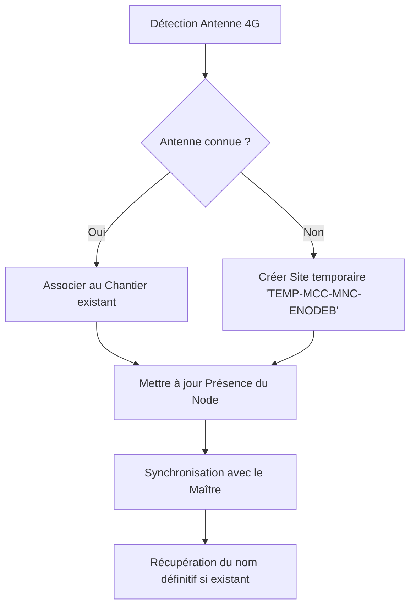

# Stratégie de Localisation et Gestion des Chantiers

Ce document décrit le fonctionnement de la localisation et de la reconnaissance automatique des chantiers pour la flotte **rpinode**.

## 1. Identification de la Position

L'identification repose principalement sur le réseau cellulaire (4G/LTE), car elle fonctionne même à l'intérieur des armoires électriques là où le GPS échoue.

### La Clé d'Antenne (eNodeB)
Pour identifier une antenne de manière stable, nous utilisons le triplet :
`MCC` (Pays) - `MNC` (Opérateur) - `eNodeB` (Antenne physique).

> **Pourquoi l'eNodeB ?**  
> L'identifiant de cellule complet (Cell ID) change selon le secteur (l'orientation de la face du pylône) auquel le boîtier se connecte. En utilisant l'eNodeB (`Cell ID // 256`), le boîtier reconnaît le chantier même s'il bascule d'un secteur à l'autre sur le même pylône.

## 2. Concepts et Entités

### Chantiers (Sites)
- **Noms communs** : Un nom de chantier (ex: "Usine Acme") est partagé par tous les boîtiers de la flotte.
- **Unicité** : Le nom du chantier est unique au sein de la base de données.
- **Clé de Synchronisation (`external_id`)** : C'est l'identifiant de référence provenant du serveur maître (`docs.deltathermic.be`). Il permet de renommer un chantier sans casser les liens.

### Flotte (Nodes)
- Chaque rpinode est identifié par son `hostname`.
- Le système garde trace de la présence de chaque boîtier sur les différents chantiers.

## 3. Relations et Contraintes

Le schéma SQL gère les relations suivantes :
- **Plusieurs chantiers par antenne** : Utile si deux sites clients sont géographiquement proches et partagent la même antenne 4G.
- **Plusieurs antennes par chantier** : Un grand chantier peut être couvert par plusieurs pylônes différents.
- **Plusieurs rpinodes par chantier** : Plusieurs techniciens ou boîtiers peuvent travailler simultanément sur le même site.

## 4. Flux de Synchronisation

Le système est conçu pour réconcilier les modifications provenant de sources multiples :

1. **Localement** : Un utilisateur renomme un chantier sur un rpinode. Le champ `is_dirty` passe à `1`.
2. **Serveur Maître** : Lors de la synchronisation, le rpinode envoie ses modifications et reçoit les renommages effectués sur le serveur ou par d'autres boîtiers.
3. **Réconciliation** : Le `external_id` sert de pivot. Si le serveur dit que l'ID `XYZ` s'appelle désormais "Site Alpha" au lieu de "Site Beta", le rpinode met à jour son dictionnaire local.

## 5. Workflow de Détection

## 6. Structure de la Base de Données

Les tables principales impliquées sont :
- `sites` : Référentiel des noms et IDs de synchro.
- `antennas` : Registre des antennes physiques détectées.
- `site_antennas` : Table de liaison entre positions et noms.
- `node_presence` : Journal de qui est/était où.
