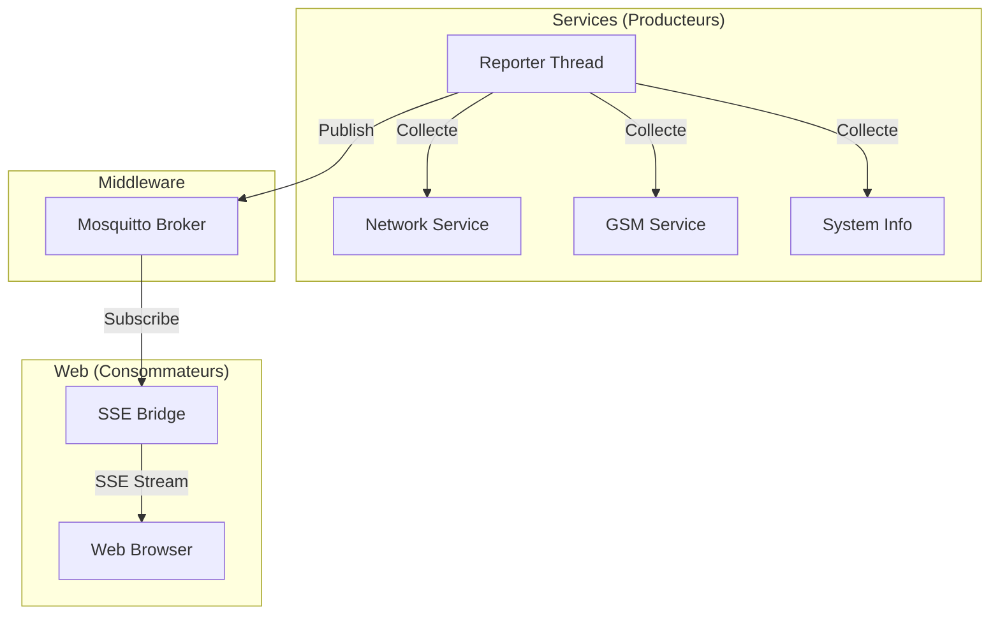

# Documentation du Flux Temps Réel (SSE & MQTT)

Cette architecture assure la mise à jour dynamique de l'interface web en utilisant un modèle **Pub/Sub** découplé.

## Architecture Globale

Le système est passé d'un modèle de *polling* (interrogation cyclique) à un modèle *événementiel* :

1. **Broker MQTT (Mosquitto)** : Pivot central de la communication locale.
2. **Reporter (`reporter.py`)** : Producteur de données. Il lit l'état du système et publie sur MQTT.
3. **Bridge SSE (`stream.py`)** : Consommateur. Il écoute MQTT et pousse les changements vers le navigateur via Server-Sent Events.

## Composants Clés

### 1. Le Broker Mosquitto
Configuré pour un usage local (`127.0.0.1`) sans authentification pour minimiser la latence et simplifier la communication entre processus internes.

### 2. Le Reporter (`src/services/reporter.py`)
Lancé comme un thread démon dans `main.py`, il centralise la collecte des données toutes les 2 secondes.
* **Topics publiés :**
    * `rpinode/status/system` : Température, heure, charge.
    * `rpinode/status/site` : Nom du chantier, état provisoire.
    * `rpinode/status/network` : État complet des interfaces (IP, MAC, Routes, Clients DHCP).
    * `rpinode/status/gsm` : Infos cellule 4G.
    * `rpinode/status/services` : État du scanner IP, configuration AP WiFi.

### 3. Le Bridge SSE (`src/web/stream.py`)
Lorsqu'un utilisateur ouvre l'interface web, une connexion SSE est établie. 
* Le bridge crée un client MQTT temporaire dédié à cette session.
* Il s'abonne à `rpinode/status/#`.
* Chaque message MQTT reçu est formaté et envoyé instantanément au navigateur.
* Un mécanisme de "Heartbeat" maintient la connexion active en l'absence de changements.

## Avantages de cette approche

1. **Performance CPU** : Le coût de collecte des données est payé une seule fois par le `Reporter`, quel que soit le nombre d'utilisateurs connectés à l'interface web.
2. **Réactivité** : Les changements sont transmis dès qu'ils sont détectés.
3. **Extensibilité** : N'importe quel nouveau script (ex: monitoring externe, automate) peut s'abonner aux topics MQTT pour obtenir l'état du boîtier sans modifier le code web.

## Comment ajouter une nouvelle donnée ?

1. **Dans le Reporter** : Ajouter la donnée dans la méthode `report_status()` et la publier sur un topic (ex: `rpinode/status/mon_service`).
2. **Dans le Bridge SSE** : Ajouter le traitement du nouveau topic dans la boucle `while True` de `handle_sse_stream` pour l'inclure dans le payload envoyé au JS.
3. **Dans le JS (`static/app.js`)** : S'assurer qu'un élément possède l'ID ou la classe `subt_ma_cle` pour que la mise à jour soit automatique.
